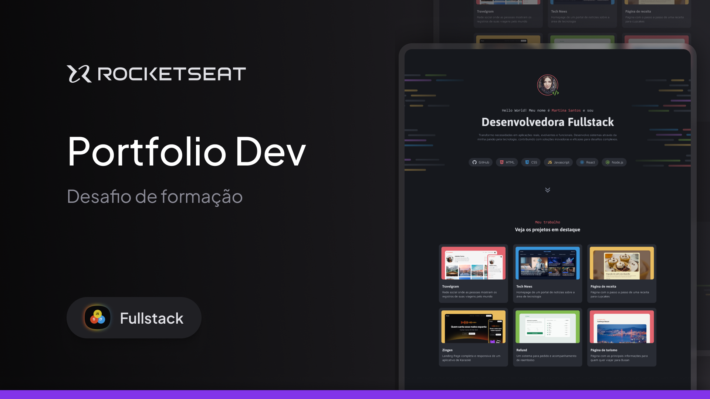

<h1 align="center">Portfólio Dev</h1>

Projeto de portfólio desenvolvido durante a formação Full-Stack da Rocketseat.  
Uma página para apresentar projetos, serviços, tecnologias e formas de contato.

  <a href="#-tecnologias">Tecnologias</a>&nbsp;&nbsp;&nbsp;|&nbsp;&nbsp;&nbsp;
  <a href="#-projeto">Projeto</a>&nbsp;&nbsp;&nbsp;|&nbsp;&nbsp;&nbsp;
  <a href="#-layout">Layout</a>&nbsp;&nbsp;&nbsp;|&nbsp;&nbsp;&nbsp;
  <a href="#memo-licença">Licença</a>

  

 

  

## 🚀 Tecnologias

Esse projeto foi desenvolvido com as seguintes tecnologias:

- HTML
- CSS
- Flexbox
- CSS Grid
- Figma
- Google Fonts

## 💻 Projeto

O Portfólio Dev é uma página de apresentação profissional desenvolvida para praticar e consolidar os fundamentos de HTML e CSS.

Durante o desenvolvimento foram aplicados conceitos de HTML semântico, Flexbox, CSS Grid, variáveis CSS, organização de estilos, componentes reutilizáveis e estados de interação com `:hover`.

A página é organizada em seções para apresentação profissional, tecnologias utilizadas, projetos em destaque, serviços oferecidos e formas de contato.

## 🔖 Layout

O projeto foi desenvolvido a partir de um layout disponibilizado pela Rocketseat no Figma.

Você pode visualizar o layout através [DESSE LINK](https://www.figma.com/pt-br/comunidade/file/1387080701963671866/portfolio-dev).

É necessário ter uma conta no [Figma](https://figma.com) para acessar o arquivo.

## :memo: Licença

Esse projeto está sob a licença MIT.

---

Feito com ♥ durante a formação Full-Stack da Rocketseat.